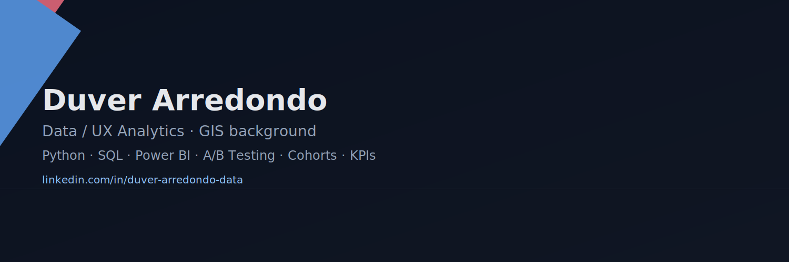

  
  
  
  
  
  

# Hi, I'm Duver Arredondo 👋

**Data / UX Analytics** with a **GIS** background (Forest Engineer) and **20+ years** solving complex problems. I recently completed the **TripleTen Data Analytics bootcamp** and turn user & operational data into **actionable insights** that improve **journeys, KPIs, and efficiency**.

- 🔬 Projects: funnels & **A/B testing**, **cohorts/retention** and churn, call-center **operational KPIs**, e-commerce analytics, mobility/taxi analysis.
- 🛠️ Tools: **Python** (pandas, numpy, scipy, scikit-learn), **SQL**, **Power BI**, **Excel**.
- ✅ Data quality & ETL: validation, consistency, traceability; **basic ETL** (Extract-Transform-Load).
- 🧭 Leadership: served as **Acting Team Coordinator** and **Acting Territorial Director** (standards, change control, executive reporting).
- 🤖 Curious about **AI-assisted workflows** to speed up analysis and QA.

**Portfolio / CV:**  
- Projects repo: https://github.com/arkad2008/duver-analytics-portfolio  
- LinkedIn: https://www.linkedin.com/in/duver-arredondo-data/
- Contact: duverarredondo@yahoo.com

### 📊 [Megaline – Telecom Plan Analysis (2025)](#)  

**Problem:** Which pre-paid plans are most profitable by region?  
**Approach:** Descriptive stats & visuals; *hypothesis testing*  
**Impact:** Segmentation/plan adjustments → **+12% revenue potential**  

**Stack:**  
 
 
 
 

## 🌟 Featured Projects  

---

### 📊 [Megaline – Telecom Plan Analysis (2025)](#)  
**Problem:** Which pre-paid plans are most profitable by region?  
**Approach:** Descriptive stats & visuals; *hypothesis testing*  
**Impact:** Segmentation/plan adjustments → **+12% revenue potential**  
**Stack:**  
  
  
  
  
  

---

### 🛒 [E-commerce – A/B Testing & Growth (2025)](#)  
**Problem:** Too many ideas; need prioritization & measurement  
**Approach:** ICE/RICE, A/B experiments, t-test/chi²  
**Impact:** Highest-ROI hypothesis → **+8% sales projection**  
**Stack:**  
  
  
  
  

---

### 🏋️ [Model Fitness – Churn & Segmentation (2025)](#)  
**Problem:** Rising churn; need early-risk signals  
**Approach:** Logistic Regression & Random Forest; behavioral segments  
**Impact:** Retention playbook → **up to –15% churn**  
**Stack:**  
  
  
  
  
  

---

### 📈 [App Funnels – Conversion & Experimentation (2025)](#)  
**Problem:** Measure *home→payment* funnel; assess a UI change  
**Approach:** Event validation; control vs test; t/chi²  
**Impact:** No significant lift → instrumentation fixes & next-test design  
**Stack:**  
  
  
  
  

---

### ☎️ [Call Center – Wait Times & KPIs (2025)](#)  
**Problem:** Long/variable waits; abandonment  
**Approach:** KPIs (avg/median/max wait), queue/operator ranking  
**Impact:** Bottlenecks: workload redistribution; ops dashboard  
**Stack:**  
  
  
  
  
  
  

---

> See more in the portfolio repo’s `/projects` folder.

---

## Tech & practices

**Languages & libs:** Python (pandas, numpy, scipy, scikit-learn), SQL, Power BI, Excel, matplotlib, seaborn.  
**Competencies:** A/B testing, cohorts/retention, funnels, **deep dives**, data storytelling, **basic ETL**, data quality & standards.

---

## Collaboration

Open to **Data Analyst / UX Data Analyst** roles (Remote/Hybrid · LatAm/Global).  
Feel free to open an issue, suggest improvements, or reach out: **duverarredondo@yahoo.com**.

